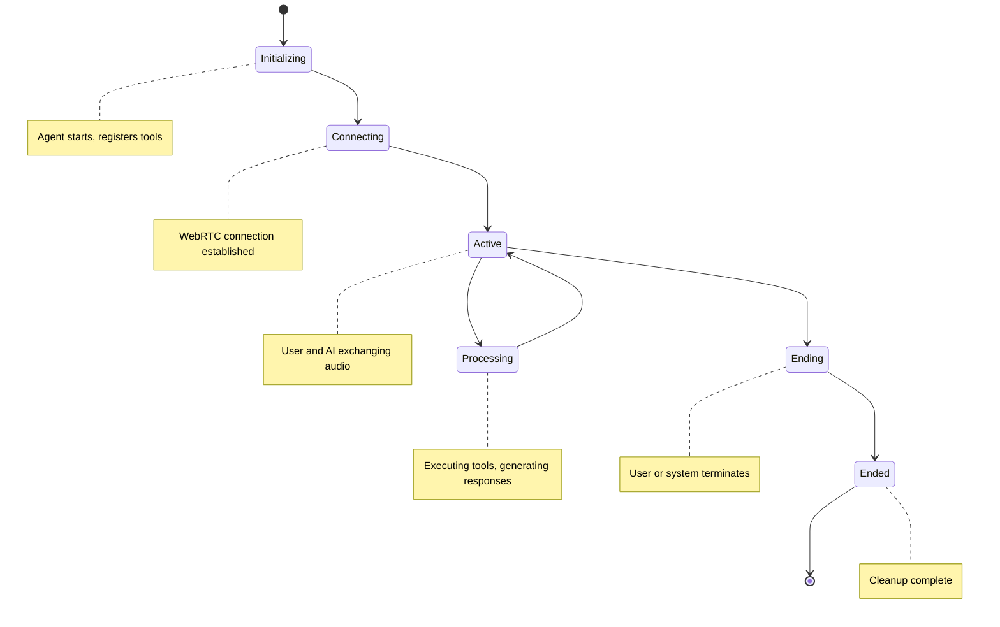

## Overview

Every conversation in Conversimple follows a predictable lifecycle with distinct phases. Understanding this lifecycle helps you build robust agents that handle all stages gracefully.

## Lifecycle Phases



## Phase Details

### 1. Initializing

**What happens:**
- Agent connects to Conversimple platform via WebSocket
- Tools are registered with the platform
- Agent enters ready state

**Duration:** Less than a second

**Your agent:**
```python
class MyAgent(ConversimpleAgent):
    async def start(self):
        """Called when agent initializes"""
        await super().start()
        # Agent is now ready for conversations
```

**Platform actions:**
- Validates authentication
- Registers your tool definitions
- Prepares for incoming conversations

### 2. Connecting

**What happens:**
- User initiates WebRTC connection from browser
- Platform creates conversation session
- Your agent receives `conversation_started` event

**Duration:** 1-2 seconds

**Your agent:**
```python
def on_conversation_started(self, conversation_id: str):
    """Called when user connects"""
    print(f"User connected: {conversation_id}")
    # Initialize conversation-specific state
    self.conversation_data[conversation_id] = {
        "start_time": datetime.now(),
        "context": {}
    }
```

**Platform actions:**
- Establishes WebRTC connection with user
- Sets up audio processing
- Connects to AI services
- Notifies your agent

### 3. Active

**What happens:**
- User speaks, audio is processed
- AI generates responses
- Tools are called as needed
- Bidirectional audio streaming

**Duration:** Varies (typically 2-30 minutes)

**Audio flow:**
```
User Speech → STT → AI → TTS → User Hears
                ↓
            Tool Calls
                ↓
            Your Agent
```

**Your agent during active phase:**
```python
def on_tool_called(self, tool_call):
    """Called when AI needs to execute a tool"""
    print(f"Executing: {tool_call.tool_name}")

@tool("Look up customer")
def get_customer(self, customer_id: str) -> dict:
    """Your tool executes during active phase"""
    return {"name": "John", "tier": "premium"}
```

**User actions:**
- Speaking to the AI
- Listening to responses
- Pausing (silence)
- Interrupting AI mid-response

**Platform manages:**
- Audio streaming and buffering
- Turn-taking and interruptions
- AI service communication
- Tool call routing

### 4. Processing

**What happens:**
- Temporary state while tool executes or AI generates response
- May occur multiple times during active phase
- Audio input may be paused during tool execution

**Duration:** Varies by tool complexity

**Your agent:**
```python
@tool_async("Complex operation")
async def complex_task(self, param: str) -> dict:
    """Long-running tool"""
    await asyncio.sleep(2)  # Simulating API call
    return {"result": "success"}

def on_tool_completed(self, call_id: str, result):
    """Called when tool finishes"""
    print(f"Tool {call_id} completed: {result}")
```

**Best practices:**
- Keep tool execution fast (under 3 seconds when possible)
- Use async tools for I/O operations
- Return partial results for long operations
- Provide progress updates if possible

### 5. Ending

**What happens:**
- User or system initiates conversation termination
- Platform begins cleanup process
- Final messages exchanged

**Duration:** Less than a second

**Termination triggers:**
- User hangs up or closes browser
- User says goodbye (AI ends conversation)
- Timeout due to inactivity
- System error requiring termination
- Agent calls `stop()` method

**Your agent:**
```python
def on_conversation_ended(self, conversation_id: str):
    """Called when conversation is ending"""
    print(f"Conversation {conversation_id} ending")
    # Save conversation data
    self.save_conversation_log(conversation_id)
```

### 6. Ended

**What happens:**
- All resources cleaned up
- Conversation data finalized
- Metrics recorded
- Connection fully terminated

**Duration:** Instantaneous

**Platform cleanup:**
- Closes WebRTC connection
- Stops audio processing
- Disconnects AI services
- Records analytics

**Your agent cleanup:**
```python
def on_conversation_ended(self, conversation_id: str):
    """Final cleanup"""
    # Remove conversation-specific data
    if conversation_id in self.conversation_data:
        data = self.conversation_data.pop(conversation_id)

        # Log metrics
        duration = (datetime.now() - data['start_time']).total_seconds()
        print(f"Conversation lasted {duration:.1f} seconds")

        # Persist important data
        self.save_to_database(conversation_id, data)
```

## Event Callbacks

Your agent can respond to lifecycle events:

```python
from conversimple import ConversimpleAgent, tool

class LifecycleAgent(ConversimpleAgent):
    def __init__(self, **kwargs):
        super().__init__(**kwargs)
        self.active_conversations = {}

    def on_conversation_started(self, conversation_id: str):
        """Conversation begins"""
        self.active_conversations[conversation_id] = {
            "start_time": datetime.now(),
            "tool_calls": 0,
            "context": {}
        }
        print(f"🎤 Started: {conversation_id}")

    def on_tool_called(self, tool_call):
        """Tool is about to execute"""
        conv_id = tool_call.conversation_id
        self.active_conversations[conv_id]["tool_calls"] += 1
        print(f"🔧 Tool: {tool_call.tool_name}")

    def on_tool_completed(self, call_id: str, result):
        """Tool finished executing"""
        print(f"✅ Completed: {call_id}")

    def on_conversation_ended(self, conversation_id: str):
        """Conversation ends"""
        if conversation_id in self.active_conversations:
            data = self.active_conversations.pop(conversation_id)
            duration = (datetime.now() - data['start_time']).total_seconds()

            print(f"📞 Ended: {conversation_id}")
            print(f"   Duration: {duration:.1f}s")
            print(f"   Tool calls: {data['tool_calls']}")

    def on_error(self, error_type: str, message: str, details: dict):
        """Error occurred"""
        print(f"❌ Error: {error_type} - {message}")
        # Handle error appropriately
```

## State Management

### Conversation-Specific State

Each conversation should have isolated state:

```python
class StatefulAgent(ConversimpleAgent):
    def __init__(self, **kwargs):
        super().__init__(**kwargs)
        self.conversations = {}

    def on_conversation_started(self, conversation_id: str):
        """Initialize conversation state"""
        self.conversations[conversation_id] = {
            "customer_id": None,
            "cart": [],
            "authenticated": False,
            "context": {}
        }

    @tool("Authenticate user")
    def authenticate(self, user_id: str, pin: str) -> dict:
        """Update conversation state"""
        conv_id = self.get_current_conversation_id()
        self.conversations[conv_id]["customer_id"] = user_id
        self.conversations[conv_id]["authenticated"] = True
        return {"authenticated": True}

    @tool("Add to cart")
    def add_to_cart(self, product_id: str) -> dict:
        """Access conversation state"""
        conv_id = self.get_current_conversation_id()
        conv = self.conversations[conv_id]

        if not conv["authenticated"]:
            return {"error": "Please authenticate first"}

        conv["cart"].append(product_id)
        return {"cart_size": len(conv["cart"])}

    def on_conversation_ended(self, conversation_id: str):
        """Clean up conversation state"""
        if conversation_id in self.conversations:
            # Save state before cleanup
            state = self.conversations.pop(conversation_id)
            if state["cart"]:
                # Save abandoned cart
                self.save_cart(state["customer_id"], state["cart"])
```

### Persistent State

For data that needs to survive across conversations:

```python
import redis
import json

class PersistentAgent(ConversimpleAgent):
    def __init__(self, **kwargs):
        super().__init__(**kwargs)
        self.redis = redis.Redis(host='localhost', port=6379, db=0)

    @tool("Get customer info")
    def get_customer(self, customer_id: str) -> dict:
        """Load from persistent storage"""
        data = self.redis.get(f"customer:{customer_id}")
        if data:
            return json.loads(data)
        return {"error": "Customer not found"}

    def on_conversation_ended(self, conversation_id: str):
        """Save to persistent storage"""
        conv_data = self.conversations.get(conversation_id)
        if conv_data and conv_data.get("customer_id"):
            # Update customer profile
            customer_id = conv_data["customer_id"]
            key = f"customer:{customer_id}"
            self.redis.set(key, json.dumps(conv_data["context"]))
```

## Handling Edge Cases

### Premature Disconnection

User disconnects unexpectedly:

```python
def on_conversation_ended(self, conversation_id: str):
    """Handle unexpected endings"""
    conv = self.conversations.get(conversation_id)
    if conv and conv.get("in_transaction"):
        # Rollback incomplete transaction
        self.rollback_transaction(conv["transaction_id"])
        print(f"⚠️ Rolled back incomplete transaction")
```

### Multiple Conversations

Handle multiple simultaneous conversations:

```python
class MultiConversationAgent(ConversimpleAgent):
    def __init__(self, **kwargs):
        super().__init__(**kwargs)
        self.conversations = {}
        self.active_count = 0

    def on_conversation_started(self, conversation_id: str):
        self.active_count += 1
        print(f"Active conversations: {self.active_count}")

        if self.active_count > 100:
            print("⚠️ High load - consider scaling")

    def on_conversation_ended(self, conversation_id: str):
        self.active_count -= 1
        print(f"Active conversations: {self.active_count}")
```

### Timeout Handling

Detect and handle inactive conversations:

```python
import asyncio
from datetime import datetime, timedelta

class TimeoutAgent(ConversimpleAgent):
    def __init__(self, **kwargs):
        super().__init__(**kwargs)
        self.last_activity = {}
        self.timeout_task = None

    def on_conversation_started(self, conversation_id: str):
        self.last_activity[conversation_id] = datetime.now()

        # Start monitoring task
        if not self.timeout_task:
            self.timeout_task = asyncio.create_task(self.monitor_timeouts())

    def on_tool_called(self, tool_call):
        """Update activity timestamp"""
        self.last_activity[tool_call.conversation_id] = datetime.now()

    async def monitor_timeouts(self):
        """Check for inactive conversations"""
        while True:
            await asyncio.sleep(30)  # Check every 30 seconds

            now = datetime.now()
            timeout_threshold = timedelta(minutes=5)

            for conv_id, last_active in list(self.last_activity.items()):
                if now - last_active > timeout_threshold:
                    print(f"⏱️ Conversation {conv_id} timed out")
                    # Conversation will end automatically
```

## Next Steps

<CardGroup cols={2}>
  <Card title="Error Handling" icon="shield" href="/core-concepts/error-handling">
    Handle lifecycle errors gracefully
  </Card>
  <Card title="State Management" icon="database" href="/guides/state-management">
    Advanced state management patterns
  </Card>
</CardGroup>
