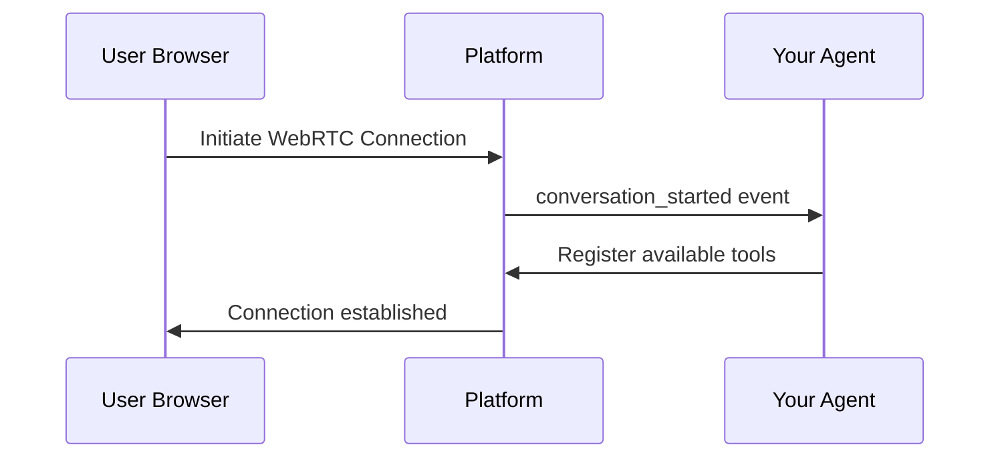
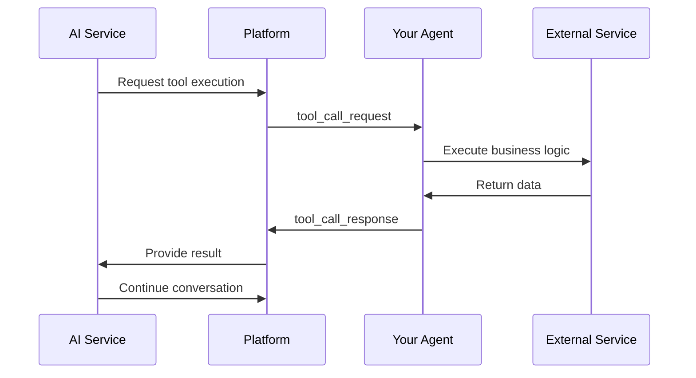

## System Architecture

Conversimple uses a simple architecture to enable real-time voice conversations:

```
┌─────────────────────────────────────────────────────────┐
│                    User's Browser                        │
│            (WebRTC Audio Input/Output)                   │
└────────────────────┬────────────────────────────────────┘
                     │ WebRTC Connection
┌────────────────────▼────────────────────────────────────┐
│              Conversimple Platform                       │
│  • Manages WebRTC connections                           │
│  • Processes audio streams                              │
│  • Handles conversation lifecycle                       │
│  • Routes function calls to your agent                  │
│  • Coordinates with AI services                         │
└───────────────────┬─────────────────────────────────────┘
                    │ WebSocket
┌───────────────────▼─────────────────────────────────────┐
│                  Your Agent (Python)                     │
│  ┌──────────────────────────────────────────────────┐  │
│  │  Tool Definitions (@tool decorator)              │  │
│  │  • get_weather(location)                         │  │
│  │  • book_appointment(date, time)                  │  │
│  │  • lookup_customer(id)                           │  │
│  └──────────────────────────────────────────────────┘  │
└─────────────────────────────────────────────────────────┘
```

## Conversation Flow

### 1. Connection Establishment

When a user initiates a conversation:



### 2. Voice Processing

Audio flows in real-time through the platform:

**Input Path: User Speech → AI Processing**
```
User Microphone
    ↓ WebRTC Audio Stream
Platform Audio Processing
    ↓ Processed Audio
Speech-to-Text Service
    ↓ Transcription
Large Language Model
    ↓ Generated Response
```

**Output Path: AI Response → User Audio**
```
Text-to-Speech Service
    ↓ Generated Audio
Platform Audio Processing
    ↓ WebRTC Audio Stream
User Speaker
```

### 3. Function Calling

When the AI needs to execute a function:



## Component Responsibilities

### Conversimple Platform

The platform handles all infrastructure concerns:
- **Connection Management**: Establishes and maintains WebRTC connections with users
- **Audio Processing**: Handles real-time audio streaming and quality
- **Conversation Coordination**: Manages conversation state and lifecycle
- **AI Integration**: Communicates with speech and language AI services
- **Function Routing**: Routes function calls between AI and your agent

### Your Agent

Your agent focuses on business logic:
- **Tool Definition**: Define available functions using `@tool` decorator
- **Event Handling**: Respond to conversation lifecycle events
- **Business Logic**: Access your databases and services, apply business rules
- **State Management**: Track conversation context and user data

## Data Flow

### Real-Time Audio Pipeline

The platform processes audio in real-time with low latency:

```
User Speech → Platform Audio Processing → Speech Recognition
                                              ↓
User Hears ← Platform Audio Processing ← Text-to-Speech
                                              ↑
                                         Language Model
```

The platform optimizes for natural conversation flow with sub-second response times.

### Function Call Flow

Function calls happen synchronously during conversation:

```python
# 1. User says: "What's the weather in San Francisco?"

# 2. AI decides to call tool
{
  "tool_name": "get_weather",
  "parameters": {"location": "San Francisco"}
}

# 3. Your agent receives and executes
@tool("Get current weather")
def get_weather(location: str) -> dict:
    return {"temperature": 72, "condition": "sunny"}

# 4. Platform receives result
{
  "temperature": 72,
  "condition": "sunny"
}

# 5. AI responds: "It's 72 degrees and sunny in San Francisco!"
```

## Scalability & Reliability

### Built for Scale
- **Conversation Isolation**: Each conversation runs independently
- **Fault Tolerance**: Automatic recovery from failures and network issues
- **Horizontal Scaling**: Platform scales across multiple servers as your traffic grows
- **High Availability**: Redundant infrastructure ensures reliability

## Next Steps

<CardGroup cols={2}>
  <Card title="Conversation Modes" icon="toggle-on" href="/platform-overview/conversation-modes">
    Learn about STT vs STS conversation modes
  </Card>
  <Card title="Use Cases" icon="lightbulb" href="/platform-overview/use-cases">
    Explore what you can build with Conversimple
  </Card>
</CardGroup>
