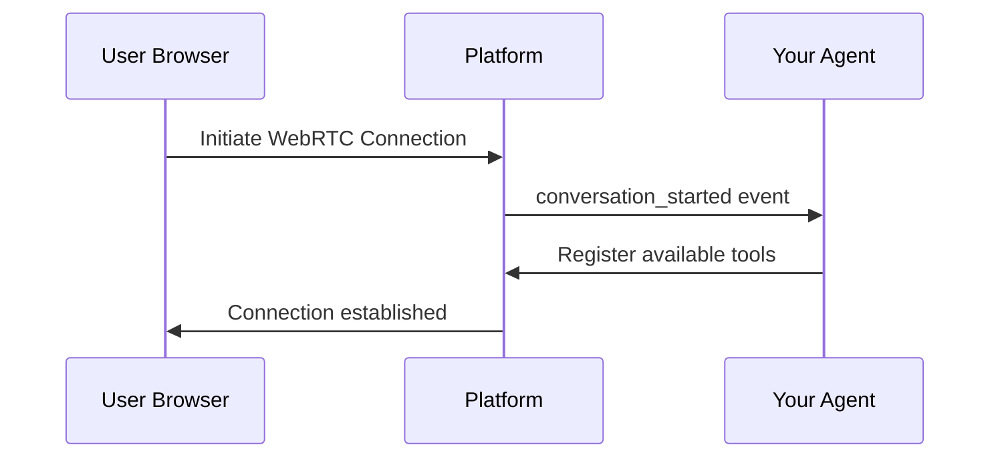
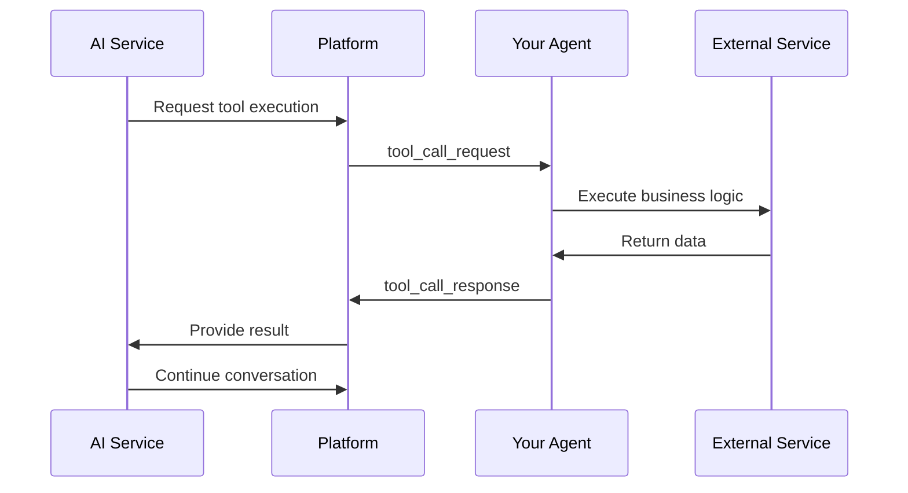

## System Architecture

Conversimple uses a multi-layered architecture to enable real-time voice conversations:

```
┌─────────────────────────────────────────────────────────┐
│                    User's Browser                        │
│            (WebRTC Audio Input/Output)                   │
└────────────────────┬────────────────────────────────────┘
                     │ WebRTC Connection
┌────────────────────▼────────────────────────────────────┐
│              Conversimple Platform                       │
│  ┌────────────────────────────────────────────────┐    │
│  │    WebRTC Media Server (Janus Gateway)         │    │
│  └────────────────────┬───────────────────────────┘    │
│                       │                                  │
│  ┌────────────────────▼───────────────────────────┐    │
│  │    Audio Processing Pipeline (Membrane)        │    │
│  │    RTP → Opus → PCM (16kHz)                    │    │
│  └────────────────────┬───────────────────────────┘    │
│                       │                                  │
│  ┌────────────────────▼───────────────────────────┐    │
│  │    Conversation Coordinator                     │    │
│  │    • Manages conversation lifecycle             │    │
│  │    • Routes function calls to your agent        │    │
│  │    • Coordinates AI services (STT/LLM/TTS)     │    │
│  └────────────────────┬───────────────────────────┘    │
│                       │                                  │
└───────────────────────┼──────────────────────────────────┘
                        │ WebSocket
┌───────────────────────▼──────────────────────────────────┐
│                  Your Agent (Python)                      │
│  ┌──────────────────────────────────────────────────┐   │
│  │  Tool Definitions (@tool decorator)              │   │
│  │  • get_weather(location)                         │   │
│  │  • book_appointment(date, time)                  │   │
│  │  • lookup_customer(id)                           │   │
│  └──────────────────────────────────────────────────┘   │
└──────────────────────────────────────────────────────────┘
```

## Conversation Flow

### 1. Connection Establishment

When a user initiates a conversation:



### 2. Voice Processing

Audio flows through multiple processing stages:

**Input Path: User Speech → AI Processing**
```
User Microphone
    ↓ WebRTC Audio Stream
Janus Gateway (Media Relay)
    ↓ RTP Packets
Audio Processing Pipeline
    ↓ Opus Decode → PCM Conversion
Speech-to-Text Service
    ↓ Transcription
Large Language Model
    ↓ Generated Response
```

**Output Path: AI Response → User Audio**
```
Text-to-Speech Service
    ↓ PCM Audio Chunks
Audio Processing Pipeline
    ↓ Opus Encode → RTP Packets
Janus Gateway
    ↓ WebRTC Audio Stream
User Speaker
```

### 3. Function Calling

When the AI needs to execute a function:



## Component Responsibilities

### Conversimple Platform

**WebRTC Management**
- Establishes and maintains WebRTC connections
- Manages media streams and audio routing
- Handles network issues and reconnections

**Audio Processing**
- Transcodes RTP to Opus to PCM format
- Buffers audio for consistent streaming
- Maintains 16kHz mono audio quality

**Conversation Coordination**
- Manages conversation state and lifecycle
- Routes function calls between AI and your agent
- Handles interruptions and turn-taking

**AI Service Integration**
- Communicates with STT providers (speech recognition)
- Sends transcripts to LLM providers (conversation generation)
- Streams responses to TTS providers (speech synthesis)

### Your Agent

**Tool Definition**
- Define available functions using `@tool` decorator
- Implement business logic for each tool
- Return results in expected format

**Event Handling**
- Respond to conversation lifecycle events
- Track conversation state
- Handle errors and edge cases

**Business Logic**
- Access your databases and services
- Apply business rules and validation
- Maintain conversation context

## Data Flow

### Real-Time Audio Pipeline

The platform processes audio in real-time with minimal latency:

```
┌──────────┐  20-50ms   ┌──────────┐  50-100ms  ┌──────────┐
│  WebRTC  │ ────────►  │  Audio   │ ────────►  │   STT    │
│  Input   │            │ Pipeline │            │ Service  │
└──────────┘            └──────────┘            └──────────┘
                                                       │
                                                 100-200ms
                                                       │
┌──────────┐  50-100ms  ┌──────────┐  100-300ms      ▼
│  WebRTC  │ ◄────────  │  Audio   │ ◄──────── ┌──────────┐
│  Output  │            │ Pipeline │           │   LLM    │
└──────────┘            └──────────┘           └──────────┘
                                                       │
                                                 200-500ms
                                                       │
                                                       ▼
                                                ┌──────────┐
                                                │   TTS    │
                                                │ Service  │
                                                └──────────┘
```

**Total latency:** 420-1000ms from user speech to AI audio response

### Function Call Flow

Function calls happen synchronously during conversation:

```python
# 1. User says: "What's the weather in San Francisco?"

# 2. AI decides to call tool
{
  "tool_name": "get_weather",
  "parameters": {"location": "San Francisco"}
}

# 3. Your agent receives and executes
@tool("Get current weather")
def get_weather(location: str) -> dict:
    return {"temperature": 72, "condition": "sunny"}

# 4. Platform receives result
{
  "temperature": 72,
  "condition": "sunny"
}

# 5. AI responds: "It's 72 degrees and sunny in San Francisco!"
```

## Scalability & Reliability

### Process Isolation
- Each conversation runs in an isolated Erlang process
- Failures in one conversation don't affect others
- Automatic process restart on failures

### Fault Tolerance
- Supervision trees ensure conversation continuity
- Automatic reconnection for network issues
- Graceful degradation when services are unavailable

### Horizontal Scaling
- Platform scales across multiple servers
- WebSocket connections distributed via load balancer
- Media servers can be added dynamically

## Next Steps

<CardGroup cols={2}>
  <Card title="Conversation Modes" icon="toggle-on" href="/platform-overview/conversation-modes">
    Learn about STT vs STS conversation modes
  </Card>
  <Card title="Use Cases" icon="lightbulb" href="/platform-overview/use-cases">
    Explore what you can build with Conversimple
  </Card>
</CardGroup>
