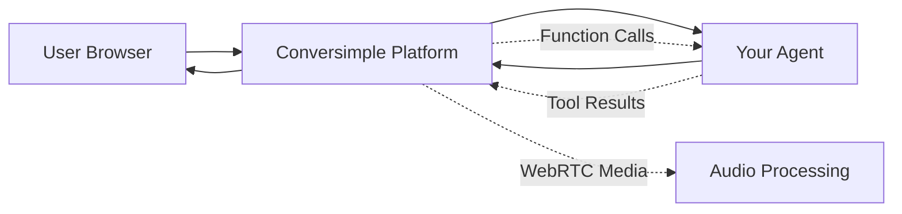

## Overview

Conversimple is a multi-tenant conversational AI platform that provides real-time voice conversation infrastructure for building AI-powered voice agents. The platform separates media processing from customer agentic workflows, allowing you to focus on building intelligent conversation logic while Conversimple handles the complex WebRTC infrastructure, audio processing, and conversation management.

## Key Features

<CardGroup cols={2}>
  <Card title="Real-Time Voice" icon="microphone">
    Ultra-low latency voice conversations with professional audio processing
  </Card>
  <Card title="Function Calling" icon="code">
    Define custom tools that AI can execute during conversations
  </Card>
  <Card title="WebRTC Infrastructure" icon="signal">
    Enterprise-grade WebRTC media relay and conversation management
  </Card>
  <Card title="Multi-Provider Support" icon="plug">
    Flexible backend with support for multiple AI service providers
  </Card>
</CardGroup>

## Architecture Philosophy

Conversimple follows a clean separation of concerns:

### Platform Responsibilities
- **Media Processing**: WebRTC communication, audio transcoding, and streaming
- **Conversation Management**: Lifecycle management, state tracking, and fault tolerance
- **Infrastructure**: Scaling, load balancing, and reliability

### Your Responsibilities
- **Business Logic**: Define what your AI agent can do and how it responds
- **Tool Implementation**: Create functions for accessing your data and services
- **Workflow Design**: Design conversation flows for your specific use case

This separation allows you to:
- Deploy custom agentic workflows without managing infrastructure
- Focus on conversation logic rather than media processing
- Scale effortlessly as your traffic grows
- Maintain full control over your business logic

## How It Works

1. **Users** connect via their web browser using WebRTC
2. **Conversimple Platform** manages the media connection and conversation state
3. **Your Agent** receives function calls and returns results
4. **Platform** coordinates with AI providers (STT, LLM, TTS) and routes audio

## Who Should Use Conversimple?

Conversimple is ideal for:

- **Product Teams** building voice-enabled applications without WebRTC expertise
- **Developers** who want to focus on conversation logic rather than infrastructure
- **Businesses** needing scalable voice AI without managing media servers
- **Enterprises** requiring multi-tenant voice conversation capabilities

## Getting Started

Ready to build your first voice agent? Check out our [Quickstart Guide](/quickstart) to create your first agent in minutes.

<Card title="Quickstart" icon="rocket" href="/quickstart">
  Create your first voice agent in under 5 minutes
</Card>
